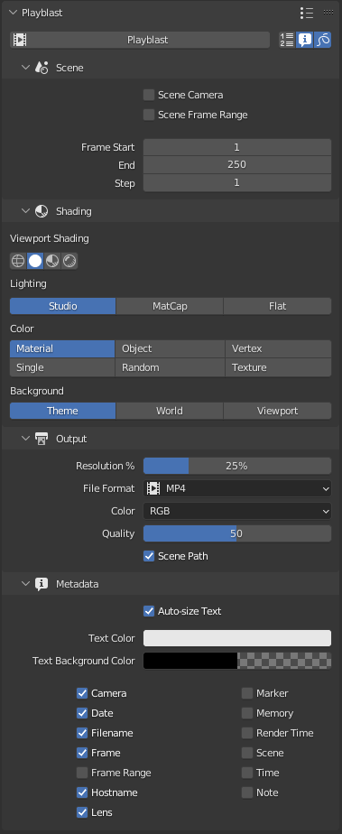
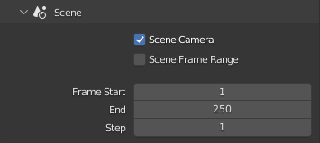
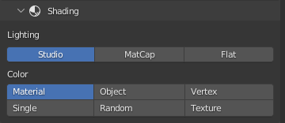
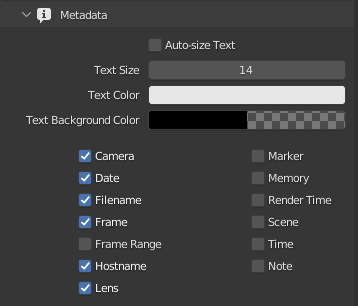

# *DuBlast* Output Settings

`Properties ▸ Output Properties ▸ Playblast`

The output settings for *DuBlast* are located in the *Output Settings* Tab of the *Properties* panel.

## Presets

Use the presets menu to save all your custom settings in handy presets.

## Operator

- {style="width:24px"} Add the current date and time in the file name, instead of overwriting the same file for each playblast.
- {style="width:24px"} Burn the metadata in the video.
- {style="width:24px"} Include annotations.  
  To render the annotations, DuBlast automatically converts the annotations to a *Grease Pencil* object, and removes it after the rendering process.

## Scene

- *Scene Camera*: always use the camera currently set to the scene.
- *Scene Frame Range*: use the frame range of the scene or a custom range.

## Shading

Adjust the shading of the viewport for the playblast.

## Output

A few formats are available (*PNG*, *JPEG*, *AVI JPEG* and *MP4*); all of them are presets carefully crafted to be animator friendly (easy to seek and play). The default is *MP4*, which will make smaller files for the same quality and can be played easily with any player on any system. These *MP4* files have custom settings to enable frame by frame seeking. They're also very fast to encode when creating the playblast.

You can set a custom output path for the playblast, different from the scene/render output.

!!! note
    When rendering to *MP4* (the default), *DuBlast* will automatically adjust the dimension of the playblast to fit *MP4* requirements (an even number of columns and lines). This will not affect the scene output settings.

## Metadata

You can burn some metadata into the image.

If the *Auto-size Text* option is checked, the font size set in the scene settings will be scaled according to the *Resolution* setting of the playblast, so that the metadata text is the same size both in the 100% output of the scene and the scaled down playblast

!!! note
    These metadata options are not the same as of the scene ; the scene options are kept separated so you can easily have different metadata between the scene and your playblasts.
